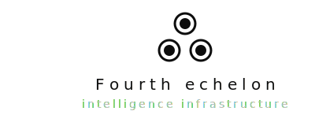

  

  

    4th echelon
  

  
  

    intelligence infrastructure
  

---

# 4th Echelon

We build risk intelligence infrastructure. The kind that tells you what's exposed before someone else figures it out first.
 
Most organizations find out they have a problem when the problem is already inside. 4th Echelon watches your attack surface continuously — credentials, infrastructure, reputation, active threat campaigns — and surfaces findings with enough context to actually act on them. Not alerts. Conclusions.
 
---
 
## What we do
 
**Enterprise risk intelligence** — continuous passive monitoring of your digital footprint against real-world threat data. Credential exposure, lookalike domain attacks, secrets in public repos, IOC matching, reputation signals. Every finding comes with a source chain and a plain-language explanation. No noise, no black boxes.
 
**Defense and critical infrastructure** — for organizations where the stakes are higher and the threat model is more serious. We don't discuss this publicly.
 
---
 
## Where we stand on ethics
 
We've made hard architectural choices about what this system will and won't do. No bulk collection. No civilian profiling. No sale to buyers whose use cases we wouldn't defend in public. These aren't internal policies subject to revision under commercial pressure — they're constraints in how the system is built.
 
We're Indian-founded, building for India's threat environment, with Article 21 and the Puttaswamy judgment in mind rather than as an afterthought. Accountability isn't a feature we added. It's the reason the thing works the way it does.
 
---
 
## Status
 
Early stage. Private build. Not open source.
 
If you represent an enterprise, institution, or research body with a genuine need — get in touch.
 
---
 
*4th Echelon — New Delhi*
